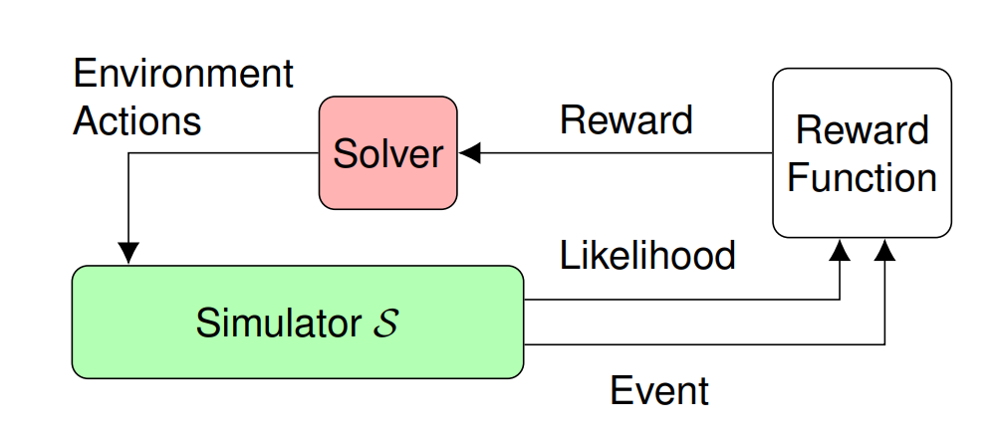
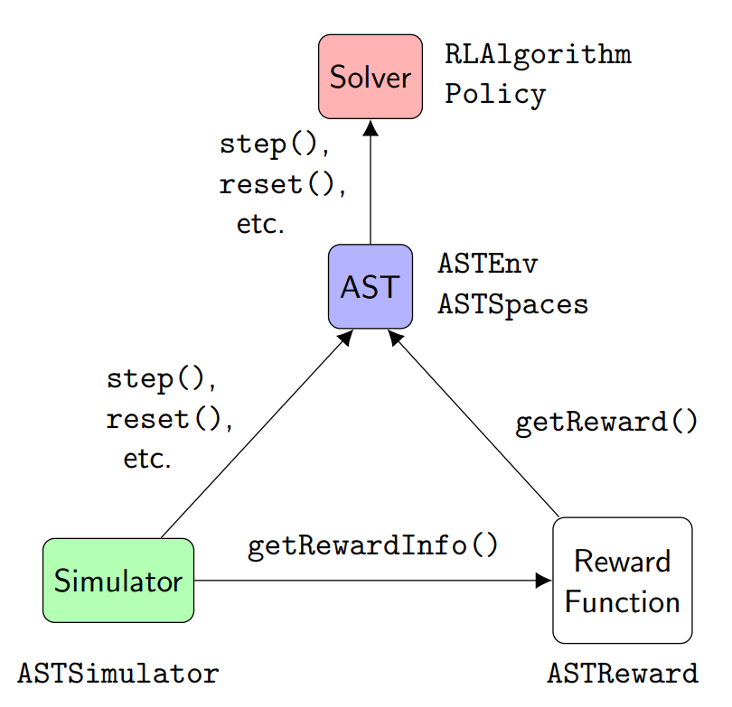

.. _usage-usage:

=====
Usage
=====

The Adaptive Stress Testing (AST) Toolbox is designed to allow users to use AST to validate their own autonomous policies within their own simulators.
AST formulates the problem of finding the most-likely failure in a system as a Markov decision process (MDP), which can then be solved with reinforcement learning (RL) techniques.
The AST methodology is shown below:

   The Adaptive Stress Testing methodology.

In AST the simulator, which contains the system under test (SUT) is treated as a black-box.
The solver tried to force failures in the SUT by controlling the simulation through the environment actions.
After a simulation rollout, the solver receives a reward, calculated by the reward function, that is dependent on if a failure occurred and how likely the trajectory was.
The solver uses the reward during optimization, allowing it to learn to cause likelier failures.
This methodology leads to the following Toolbox framework:

   The AST Toolbox framework architecture.

The ASTEnv is the core of the toolbox.
Using the provided wrappers, the ASTEnv turns a user's simulator into a gym environment, which can then be solved using existing reinforcement learning software.
In order for this to work, a user must define their state and action spaces as an ASTSpaces class, define their reward function as an ASTReward class, and provide the ASTEnv control of the simulator through the ASTSimulator class.
Solvers are built on the Garage framework.

We have created a :ref:`tutorial <tutorial-tutorial>` to show users how to use the Toolbox to validate an autonomous policy.
