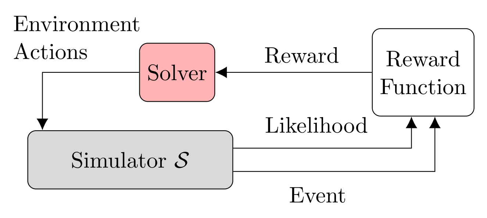

# Summary

\href{https://github.com/sisl/AdaptiveStressTestingToolbox}{The AST Toolbox} is a python package that uses reinforcement learning to find failures in autonomous systems while treating the system and the simulator as black-boxes.
Adaptive stress testing (AST) was recently developed to identify the most likely failure of a system in simulation [@lee2015adaptive].
AST frames the validation problem as a Markov decision process (MDP) [@DMU], where the AST agent controls the simulation through environment actions to find the most likely failure in the system under test [@koren2020formulation].
Understanding the most likely failure allows engineers to address issues in their system prior to deployment.
To facilitate the use of AST for validation, this paper presents a new software package called the AST Toolbox.

The AST Toolbox is a software package for integrating AST with any simulator, making validation of autonomous agents easier.
There are three major components to the toolbox: the solvers, the simulator interface, and the reward function.
The solvers are different algorithms for finding the most likely failure of the system under test.
The AST simulator interface provides a systematic way of wrapping a simulator to be used with the AST environment.
The reward function uses the standard AST reward structure [@koren2020formulation] together with heuristics to guide the search process and incorporate domain expertise.

The AST method is shown in \autoref{fig:ast_method}, and the corresponding AST Toolbox architecture is shown in \autoref{fig:ast_arch}.
The three core concepts of the AST method (simulator, solver, and reward function) have abstract classes associated with them.
These base classes provide interfaces so they can interact with the AST module, represented by the `ASTEnv` class.
`ASTEnv` is a gym environment [@brockman2016openai] that interacts with a wrapped simulator `ASTSimulator` and a reward function `ASTReward`.
In conjunction with `ASTSpaces`, which are gym spaces, the AST problem is encoded as a standard gym reinforcement learning problem.
Many open-source reinforcement learning algorithms are written to work with gym environments, and our solvers are implemented using the `garage` framework [@garage].
The solver derives from the `garage` class `RLAlgorithm`, and uses both a `Policy`, such as a Gaussian LSTM, and an optimization method, such as TRPO [@schulman2015trust] and PPO [@schulman2017ppo].
Using the `garage` framework, new solvers can be quickly implemented.

# Statement of Need

Prior to deployment, it is important to validate that autonomous systems behave as expected to help ensure safety.
It is generally difficult to provide comprehensive testing of a system in the real world because of the large space of possible edge cases.
In addition, real-world testing might present a safety risk.
We therefore have to rely upon simulation using models of the environment to provide an adequate level of test coverage.

However, even in simulation, validating the safety of autonomous systems is often challenging due to high-dimensional and continuous state-spaces.
Recent research has explored the use of adaptive stress testing (AST) for finding the most likely system failures in simulation using reinforcement learning.
Finding the most likely examples of a system's failures may highlight flaws that we wish to fix.
Adaptive stress testing has the flexibility of treating the simulator as a black box, meaning that access to the simulation state is not needed, allowing AST to be used to validate policies from a wide range of domains.
To facilitate the general use of adaptive stress testing for validation, this paper presents a new software package called the AST Toolbox.

# Research and Industrial Usage

The authors have published multiple papers on AST at venues including the Intelligent Vehicle Symposium (IV), the Intelligent Transportation Systems Conference (ITSC), and the Digital Avionics Systems Conference (DASC).
Research vectors include adding new solver algorithms [@koren2018adaptive] [@koren2020adaptive] , improving failure diversity [@corso2019adaptive], adding interpretability [@corso2020interpretable], and improving scalability [@koren2019efficient].
Applications have included autonomous vehicles, aircraft collision avoidance software, aircraft flight management systems [@moss2020adaptive], and image-based neural network controllers [@julian2020validation].
We have also worked with a range of industrial and government partners, including Nvidia, NASA Ames, Uber ATG, Samsung, and the FAA.

# Figures

\tikzset{
  >={Latex[width=2mm,length=2mm]},
  % Specifications for style of nodes:
            base/.style = {rectangle, rounded corners, draw=black,
                           minimum width=1cm, minimum height=1cm,
                           text centered}, % , font=\sffamily
            simulator/.style = {base, fill=gray!30}, % green!30
            solver/.style = {base, fill=red!30},
            reward/.style = {base, minimum height=1.5cm},
            ast/.style = {base, fill=blue!50!black!20}, % blue!30
            module/.style = {base, minimum width=2.5cm, minimum height=1.5cm, fill=blue!30},
            module2/.style = {base, minimum width=2.5cm, minimum height=1.5cm, fill=white},
            sim_decision/.style = {simulator, diamond, draw, text width=4.5em, text badly centered, node distance=3cm, inner sep=0pt}
}

\begin{figure}[tbp]
    \centering
    \resizebox{\textwidth}{!}{\input{ast_method.tex}}
	\label{fig:ast_method}
	\caption{The AST method and the AST Toolbox architecture.}
\end{figure}

{ width=70% }

{ width=80% }

\begin{figure}[tbp]
	\centering
	\begin{subfigure}[t]{0.45\linewidth}
	    \centering
        \resizebox{\textwidth}{!}{\input{ast_method.tex}}
        \subcaption{The AST method. The simulator is treated as a black box. The solver optimizes a reward based on transition likelihood and whether an event has occurred.}
    	\label{fig:ast_method}
    \end{subfigure}\qquad
    \begin{subfigure}[t]{0.45\linewidth}
	    \centering
        \resizebox{\textwidth}{!}{\input{ast_arch.tex}}
        \subcaption{The AST Toolbox architecture. \texttt{ASTEnv} combines the simulator and reward function in a gym environment. The solver is implemented using the \textit{garage} package.}
    	\label{fig:ast_arch}
    \end{subfigure}
    \caption{The AST method and the AST Toolbox architecture.}
	\label{fig:ast_compare}
\end{figure}

# Acknowledgments

# References
